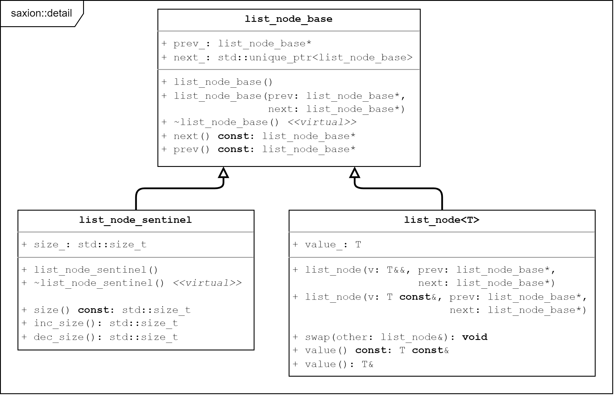
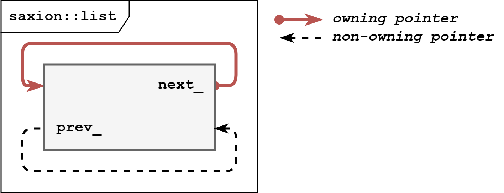
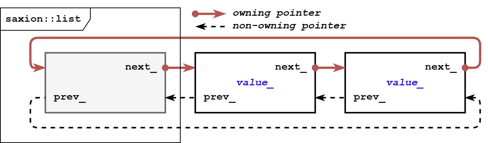

# Assignment 4 - Iterator

## Linked list

In this assignment you will program two iterators for a doubly linked list *class template* `saxion::list<T>` defined in [lib_ds/include/list.h](lib_ds/include/list.h). 

The `list` class template starts with:

```c++
template<typename T>
class list {
public:
  using value_type = T;
  using reference = T&;
  using const_reference = T const&;
  using pointer = T*;
  using const_pointer = T const*;
  using size_type = std::size_t;

private:
  using node_t = detail::list_node<T>;
  using sentinel_node_t = detail::list_node_sentinel;

  // sentinel node, also stores the size of the list
  sentinel_node_t node_{};

  /* ... */
};
```

As you can see, among many useful few *type aliases*, two different node types are defined: `node_t` (alias for `detail::list_node<T>`) and `sentinel_node_t` (alias for `detail::list_node_sentinel`). Both of them derive from a common base class `detail::list_node_base` that provides the list linking functionality. It does it by storing the `next_` and `prev_` pointers. 



The `list_node<T>` class is used for nodes with actual data. It inherits from `list_node_base` and adds a data member `value_` of the templated type `T`. The `list_node_sentinel` class is used for the so-called *sentinel node* of the list. It also inherits from `list_node_base` and adds a data member `size_` that stores the number of elements in the list. The `list` class has a member `node_` of type `list_sentinel_node`. Besides the list's size, this node also stores the `head` and `tail` pointers of the list. `node_.next_` points to the first element of the list (the list's head) and `node_.prev_` points to the last element of the list (the list's tail).

If the list is empty, the `head` and `tail` pointers point to the sentinel node itself.  

```c++
// an empty list with just the sentinel node (node_) present
saxion::list<int> lst{};

assert(lst.node_.next_.get() == &lst.node_);
assert(lst.node_.prev_ == &lst.node_);
```

 

It makes checking if a list is empty very easy: `node_.prev_ == &node_` and `node_.next_.get() == &node_` are `true` if and only if the list is empty.


Once more elements are added to the list, the sentinel node's `next_` and `prev_` pointers point to the first (`head`) and last (`tail`) elements respectively:

 


This design simplifies traversing the list and working with iterators. The `begin()` and `end()` functions of `list` return iterators that point to the first and one past the last element respectively. The `begin()` function returns an iterator that points to the first element, which is the node after the sentinel node (`node_.next_`). The `end()` function returns an iterator that points to the sentinel node itself. This way the `end()` iterator is always valid, even if the list is empty.

## Tests

This assignment comes with four pre-defined targets:

* *dummy* with code in `lib_ds/dummy.cpp`. This is just a simple executable that shows the use of `lib_ds::list`. It comes with enabled sanitizers and you can modify it to test your code.

* *tests_custom* with code in `tests/list/custom_tests.cpp`. This is a unit-test file using the googletest framework. There are (almost) no tests in it but you can put yours there if you want to.

* *tests_list* with code in `tests/list/list_tests.cpp`. This unit-tests the doubly-linked list implementation using the googletest framework. **Some tests at the end are commented out** because they won't compile now. You can uncomment them once you implemented iterators.

* *tests_iterators* with code in `tests/list/list_iterator_tests.cpp`. This target contains unit tests only fot the list iterators. It won't compile when you run it now. When you implement your iterators, you can use those tests to check if they work correctly.


## Task

Your task is to program two class templates, `list_iterator` and `const_list_iterator`. They are almost identical, the only difference is that the `const_list_iterator` does not allow modifying the list elements. Both of them should be *bidirectional iterators*.

The iterator classes are already present in the [lib_ds/include/list.h](lib_ds/include/list.h) file, but they are almost empty. You need to implement them. The code already present is:

```c++
template<typename T, typename NodeT = list_node_base>
struct list_iterator {

  // list is a friend of the iterator
  template<typename> friend
  class ::saxion::list;

  // use node_t as the node type for the iterator
  using node_t = NodeT;

  // current node pointed to by this iterator
  node_t current_;
};


template<typename T, typename NodeT = list_node_base>
struct const_list_iterator {

  // list is a friend of the iterator
  template<typename> friend
  class ::saxion::list;

  // use node_t as the node type for the iterator
  using node_t = NodeT;

  // current node pointed to by this iterator
  node_t current_;
};

/// equality operator to allow comparison between the const and non-const iterators
template <typename T, typename NodeT>
[[nodiscard]]
inline bool operator==(const list_iterator<T, NodeT>& lhs, const const_list_iterator<T, NodeT>& rhs) {
  return lhs.current_ == rhs.current_;
}

/// "inequality operator" to allow comparison between the const and non-const iterators
template <typename T, typename NodeT>
[[nodiscard]]
inline bool operator!=(const list_iterator<T, NodeT>& lhs, const const_list_iterator<T, NodeT>& rhs) {
  return !(lhs == rhs);
}
```

> As you can see, the `current_` member stores a pointer to the node pointed to by the iterator. Its type is `list_node_base*`, which is the base class for both `list_node` and `list_node_sentinel`. This way the iterator can point to any node in the list, including the sentinel node. You can navigate the list using the `next_` and `prev_` pointers stored in the `current_` node.
> However, when trying to get the value stored in the node, you'll need to cast the `current_` pointer to the 'list_node<T>' type. Like this:
>    ```c++
>    // get the value pointed to by the iterator
>    auto& value = static_cast<list_node<T>*>(current_)->value_;
>    ```
>
> You don't need to check if by user's mistake the iterator points to the sentinel node when casting. You also don't need to use `dynamic_cast` to cast safely. Only the `end()` iterator points to the sentinel node and it's illegal to do anything with the `end` iterator.

## To implement

Implement both iterators, `list_iterator` and `const_list_iterator` so that they become usable. The only notable difference between them is that in operators that return a reference or a pointer to the value pointed to by the iterator, the `const_list_iterator` should return a `const` reference or pointer. For instance (simplified example):

```c++
struct list_iterator {
  SomeType& operator*() const;
};

struct const_list_iterator {
  
  const SomeType& operator*() const;
};
```

### Aliases

Define the following type aliases in both iterator classes:

- `value_type` - the type of the value pointed to by the iterator
- `reference` - the type of the reference to the value pointed to by the iterator (pay attention to const vs. non-const iterator type)
- `pointer` - the type of the pointer to the value pointed to by the iterator (pay attention to const vs. non-const iterator type)
- `difference_type` - the type of the difference between two iterators
- `iterator_category` - the type of the iterator category (bidirectional iterator)
- `iterator_concept` - the type of the iterator concept (same as the category)

### Functions

You need to implement the following functions for each iterator:

* Constructor that takes a node pointer as an argument and initializes the `current_` member with it. This constructor is used by the `list`'s `begin()` and `end()` functions. 

* `node_t* node() const` that returns the current node pointed to by the iterator.

* Decrement and increment operators, both pre- and post- variants. Those functions must move the iterator to the previous or next node respectively. 

* Equality operator, this function compares iterators of the same type and return `true` if they point to the same node. You can implement it either as a member function or as a free `friend` function.

* Inequality operator, this function compares iterators of the same type and return `true` if they point to different nodes. You can implement it either as a member function or as a free `friend` function.

* Dereference operator, this function returns a reference to the value pointed to by the iterator. 

* Member access operator (arrow operator), this function returns a pointer to the value pointed to by the iterator. 


That's really all when it comes to implementation.

## How to start

1. Open the project, loading the top-level CMakeLists.txt file in your IDE. It'll take some time to load and configure.

2. You can run any of the targets *test_custom*, *test_list* or *dummy* to see what happens. 

3. Try to familiarize yourself with the list implementation in [lib_ds/include/list.h](lib_ds/include/list.h). Play around with it using the *dummy* and the *tests_custom* targets. 

4. Once you are ready, start implementing the iterators. You can use the *tests_iterators* target and the *tests_list* target (after uncommenting the tests) to check if your iterators work correctly.

5. It's unlikely, but you might get memory issues. The sanitizers are enabled on all targets, so check the *Sanitizers* tab from time to time to see if nothing pops up there.

6. When you are ready, submit just the [list.h](lib_ds/include/list.h) file. Just this one file and nothing else.

That's all, good luck!
